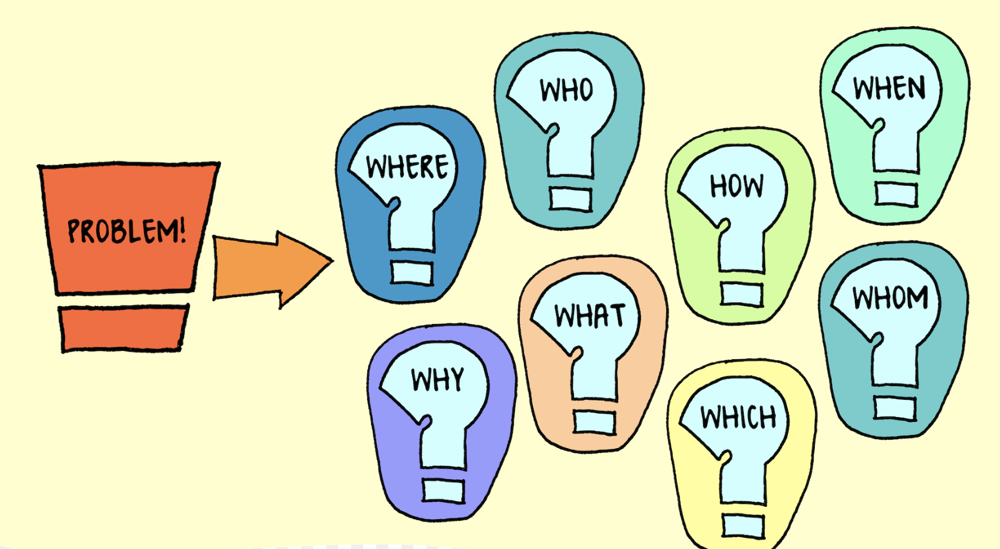

  

# **Hi there** 👋

- :mortar_board: CS grad from [The University of New South Wales, Sydney](https://www.unsw.edu.au/)
- :computer: Specialized in MLOPS, Edge Computing, Distributed AI, SRE and open source in general
- :office: Working as a freelance AI Consultant
- :money_with_wings: Active forex and Commodity trader and a medium term investor

## Stay Connected

    
	
    
    
    

## Tech Stack

### Languages I use to communicate with machines

### Data stores

### Tools and Technologies I use everyday

### OS

### Some of my featured projects

- [Vehicle and Speed Identification](https://github.com/kmr0877/Vehicle-and-Speed-Identification)
- [Crusher Light Predictor](http://www.austmine.com.au/News/telfer-digital-program-kicks-off-with-crusher-traffic-light-prediction-project)
- [Best Primary Industry IoT Project, IOTHUB Australia](https://www.iothub.com.au/news/announcing-the-2019-iot-award-winners-526963)
  - [Featured in Insight's Client Story](https://au.insight.com/en_AU/content-and-resources/case-studies/newcrest-mining-azure-iot.html)
  - [Featured in Microsoft's Customer Success Stories](https://au.insight.com/en_AU/content-and-resources/case-studies/newcrest-mining-azure-iot.html)
- [Automated Grading Tool to Assess Short Answer Questions](https://ieeexplore.ieee.org/document/8615228)

### Buzzwords I am focused on these days :astonished:

- [Distroless Docker Images](https://github.com/GoogleContainerTools/distroless#distroless-docker-images)
- [Serverless Inferencing on Kubernetes](https://arxiv.org/abs/2007.07366)
- [Serverless workflows for Real-Time Events and Data Processing](https://github.com/nuclio/nuclio#nuclio---serverless-for-real-time-events-and-data-processing)
- [Concept Drift](https://arxiv.org/pdf/1704.00362.pdf)
- [Kubeflow](https://www.kubeflow.org/)
